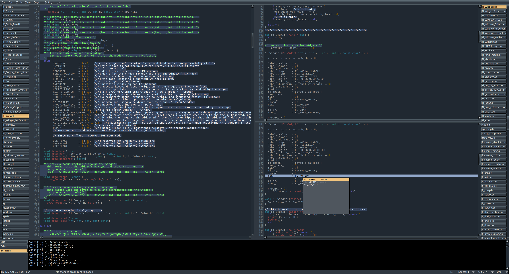

# flEdit
FlEdit is a portable lightweight text editor that is using the [FLTK](https://github.com/fltk/fltk) gui library.
It has been tested on Windows 10 and Xubuntu. It might work on macOS with some tweaks.
The editor widget is based on the Fl_Text_Editor in FLTK but has been extended.

This is a **personal** project that has no intention to become something more than it is now.
It is more or less feature complete at this point.

**THIS SOFTWARE IS PROVIDED ON AN "AS IS" BASIS, AND OFFERS NO GUARANTY THAT IT WILL WORK AS INTENDED.
USE FLEDIT AT YOUR OWN RISK**.

## List of more advanced editors
* [Vim](https://www.vim.org/)
* [GNU Emacs](https://www.gnu.org/software/emacs/)
* [Kate](https://kate-editor.org/)
* [SciTE](https://scintilla.org/SciTE.html)
* [Sublime](https://www.sublimetext.com/)
* [Visual Studio Code](https://code.visualstudio.com/)

## License
FlEdit is released under the [GNU General Public License v3.0](LICENSE).

## Some of the Features
* Syntax highlightning for some of the most common languages.
* Unlimited undo/redo (different from the built in version in Fl_Text_Editor).
* Search replace in current file and all opened files.
* Search with PCRE regex.
* Find lines in current file and all opened files.
* Autocomplete.
* Move lines up/down.
* Shift text left/right.
* Sort lines.
* Convert selected text to upper/lower case.
* Comment lines.
* Select text between matching `{}` pairs.
* Bookmarks.
* Project management.
* Two views of the same file (vertical/horizontal).
* Two files side by side (vertical/horizontal).
* Execute commands from flEdit and receive output to flEdit.
* Different themes for the gui.
* Different schemes for the syntax highlightning.

## Download
Download flEdit from [here](https://github.com/gnuwimp/test/releases).  

## Compiling
To build it you need a C++ 17 compiler (gcc/msys2) and [FLTK](https://github.com/fltk/fltk) library. 
FLTK must be compiled with `--enable-use_std` flag.
The source will NOT compile with Microsoft Visual Studio.
It also needs PCRE and sqlite3 libraries but these are included in the source directory.

## Screenshots
One file with two views 

Project with 372 files 

Preference dialog 

Color scheme dialog 

